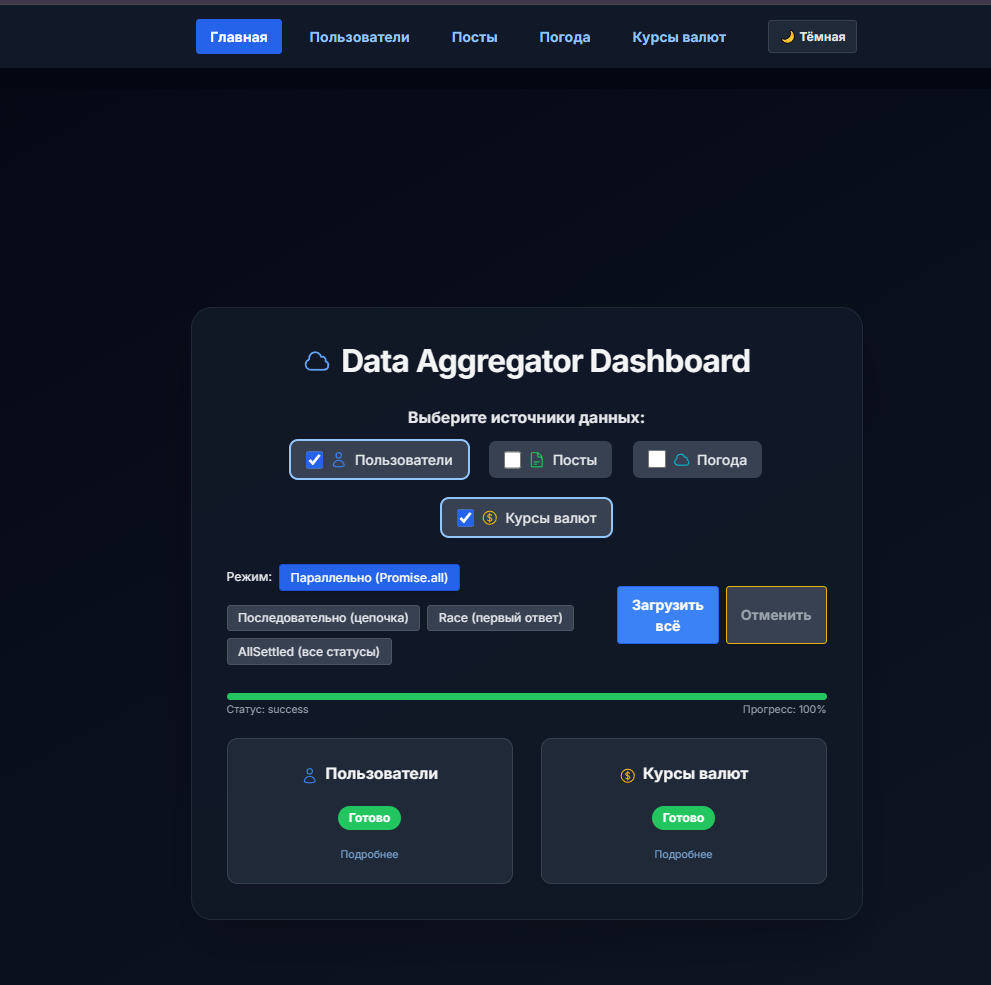
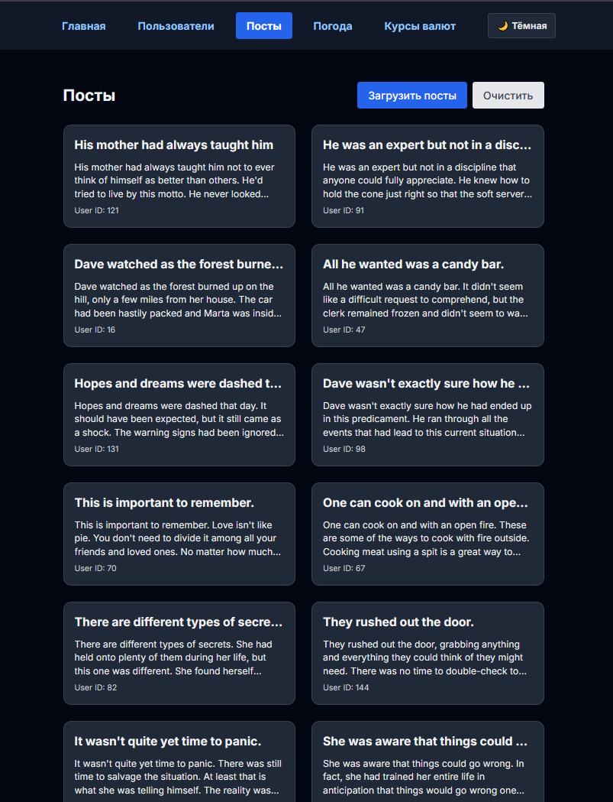
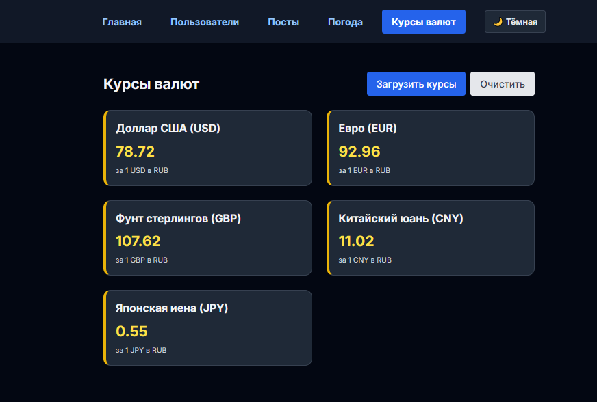
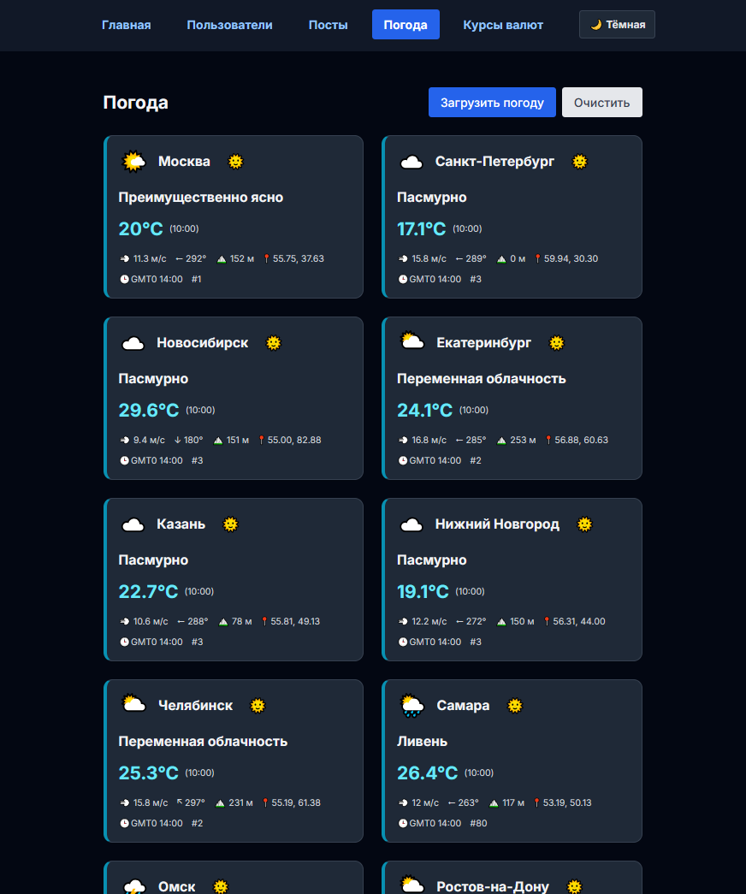
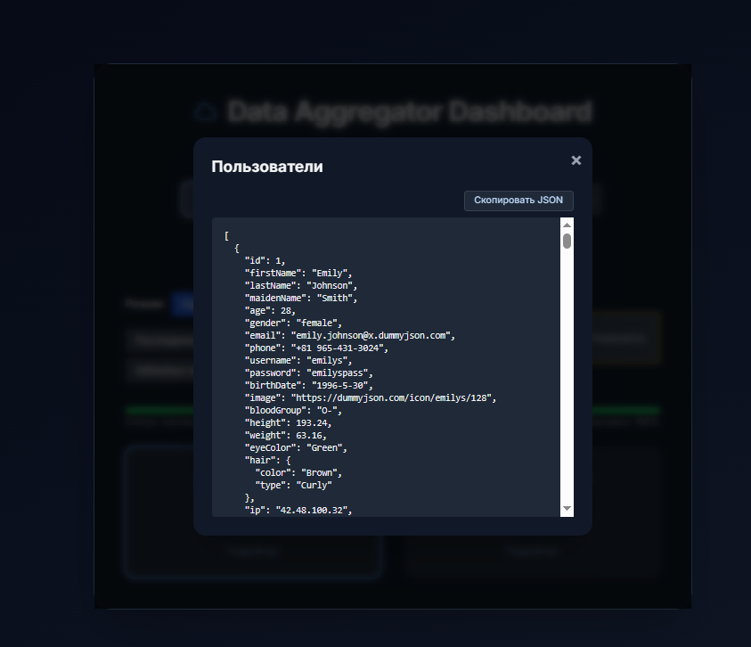

# 🚀 Data Aggregator Dashboard


**Data Aggregator Dashboard** — современный, многостраничный React-проект для агрегации и визуализации данных из публичных API. Максимум внимания архитектуре, UX, качеству кода, тестам и автоматизации.

---

## 🌟 Ключевые возможности

-   Агрегация данных: пользователи, посты, погода, курсы валют
-   Многостраничный интерфейс, современный роутинг
-   Режимы загрузки: параллельно, последовательно, race, allSettled
-   Адаптивный дизайн, мгновенная тёмная/светлая тема
-   Информативные карточки, модальные окна, копирование JSON
-   Централизованный прогресс-бар, статус загрузки
-   Полное покрытие тестами (Jest, Testing Library)
-   CI/CD-ready: строгий линтинг, чистый код, актуальная документация

---

## 📦 Быстрый старт

```bash
# Клонируйте репозиторий
 git clone https://github.com/FrankFMY/Data-Aggregator-Dashboard-ReactJS.git
 cd Data-Aggregator-Dashboard-ReactJS

# Установите зависимости
 npm install

# Запустите проект
 npm run dev

# Запустите тесты и линтер
 npm run lint
 npm test
```

---

## 🛠️ Архитектура

-   `src/pages/` — страницы (Dashboard, Users, Posts, Weather, Currency)
-   `src/features/` — бизнес-логика по фичам
-   `src/shared/` — переиспользуемые компоненты (Modal, Loader, ErrorBlock, Notification, Skeleton, ResultCard)
-   `src/hooks/` — кастомные хуки (usePersistentResource, useAsync, useFetch, usePromiseManager)
-   `src/api/` — работа с внешними API
-   `src/types/` — типы и интерфейсы
-   `src/utils/` — утилиты

> KISS, DRY, SOLID, YAGNI — архитектурные принципы строго соблюдаются

---

## 🪝 Асинхронные хуки

-   **usePersistentResource** — универсальный хук для загрузки, кэширования и очистки данных с поддержкой localStorage, состояний loading/error/data. Идеален для страниц с кэшированием (валюты, погода, посты, пользователи).
    ```ts
    const { data, loading, error, load, clear } = usePersistentResource<
        MyType[]
    >({
        storageKey: 'my-key',
        fetcher: fetchMyData,
    });
    ```
-   **useFetch** — универсальный хук для fetch-запросов с отменой, таймаутом, aborted.
-   **useAsync** — универсальный хук для любых асинхронных функций с поддержкой retry/maxAttempts.
-   **usePromiseManager** — продвинутый хук для управления массивом асинхронных функций (режимы: parallel, sequential, race, allSettled, retry, timeout, отмена, прогресс).

---

## ⚡ Уникальный UX

-   Анимированный выбор режима загрузки
-   Всплывающие подсказки
-   Модальные окна с подробностями и копированием JSON
-   Мгновенное переключение тёмной/светлой темы
-   Адаптивность для любых устройств

---

## 🔄 Режимы загрузки данных

| Режим           | Описание                                                                 |
| --------------- | ------------------------------------------------------------------------ |
| Параллельно     | Все запросы одновременно. Ошибка любого — ошибка всей группы             |
| Последовательно | Запросы по очереди, следующий стартует после завершения предыдущего      |
| Race            | Результат — первый успешно завершившийся запрос, остальные отменяются    |
| AllSettled      | Все запросы параллельно, возвращаются статусы всех, независимо от ошибок |

---

## 🧪 Качество и тесты

-   Покрытие тестами всех хуков, компонентов, страниц
-   Строгий ESLint, no warnings, no unused code
-   Проверка на CI/CD: тесты, линтер, сборка
-   Документация всегда актуальна

---

## 📸 Примеры интерфейса (тёмная тема)

### Главная панель



### Пользователи


### Посты



### Курсы валют



### Погода



### Модальное окно



---

## 🧑‍💻 Вклад и стиль

-   Pull requests приветствуются!
-   Соблюдайте архитектурные принципы и стиль кода (camelCase, PascalCase, KISS, DRY)
-   Не забывайте про тесты и документацию

---

## 📄 Лицензия

MIT License. Свободно для любых целей. См. LICENSE.

